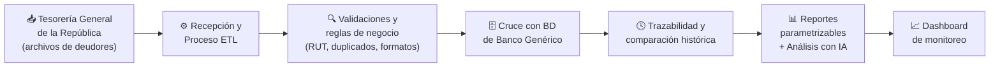

# TTDH Automation

> Plataforma para la automatización del procesamiento e integración de información de registros de deudores entre la **Tesorería General de la República** y **Banco Genérico**.


-blue)


Proyecto **Capstone (APT)** de la carrera de Ingeniería en Informática — Duoc UC, Sede Padre Alonso de Ovalle.

---

## 📑 Tabla de contenidos

- [Descripción](#-descripción)
- [Problema que resuelve](#-problema-que-resuelve)
- [Arquitectura de la solución](#-arquitectura-de-la-solución)
- [Características principales](#-características-principales)
- [Requerimientos funcionales](#-requerimientos-funcionales)
- [Stack tecnológico](#-stack-tecnológico)
- [Estructura del repositorio](#-estructura-del-repositorio)
- [Instalación y ejecución](#-instalación-y-ejecución)
- [Metodología y planificación](#-metodología-y-planificación)
- [Equipo](#-equipo)
- [Licencia](#-licencia)

---

## 📌 Descripción

**TTDH Automation** es una plataforma informática que automatiza el procesamiento de información de registros de deudores, desde su recepción y validación hasta el cruce con las bases de datos de la organización y la generación de reportes.

La solución incorpora un proceso **ETL** capaz de trabajar con distintos formatos de archivos, aplicar reglas de validación y de negocio, detectar cambios respecto de procesos anteriores y mantener la trazabilidad de cada ejecución. Además, permite generar reportes parametrizables e integra un componente de **Inteligencia Artificial** para apoyar la detección de anomalías y sugerir nuevas validaciones.

## 🎯 Problema que resuelve

El procesamiento manual de grandes volúmenes de datos de deudores —recibir, revisar, validar, cruzar y analizar información— es propenso a errores, duplicidad de tareas, dificultad para detectar inconsistencias y limitada trazabilidad.

TTDH Automation busca:

- ✅ Automatizar y centralizar el procesamiento de los datos.
- ✅ Detectar cambios e inconsistencias entre ejecuciones.
- ✅ Mantener trazabilidad histórica de cada proceso.
- ✅ Generar reportes parametrizables.
- ✅ Reducir errores asociados a tareas manuales y mejorar la eficiencia del proceso.

## 🏗 Arquitectura de la solución

El flujo general de la plataforma es el siguiente:



1. **Entrada:** la Tesorería General de la República envía periódicamente archivos con los datos de los deudores.
2. **Procesamiento (ETL):** la plataforma recibe los archivos y ejecuta un proceso que extrae, transforma y valida la información (RUT, duplicados, campos incompletos y formatos), aplicando las reglas de negocio definidas.
3. **Cruce de datos:** la información validada se cruza con las bases de datos de Banco Genérico para identificar coincidencias, cambios e inconsistencias.
4. **Trazabilidad:** se registra cada ejecución, manteniendo el historial y la comparación entre procesos.
5. **Salidas:** se generan reportes parametrizables y se aplica un componente de IA para detectar anomalías y sugerir validaciones.
6. **Monitoreo:** los resultados se visualizan en un dashboard de seguimiento.

## ✨ Características principales

- Recepción de archivos en múltiples formatos (CSV, Excel, entre otros).
- Proceso ETL configurable (extracción, transformación, validación y carga).
- Validaciones automáticas: RUT, duplicados, campos incompletos y formatos.
- Aplicación de reglas de negocio.
- Cruce e integración con bases de datos existentes.
- Comparación histórica y trazabilidad de ejecuciones.
- Reportes parametrizables y exportables.
- Componente de Inteligencia Artificial para detección de anomalías.
- Dashboard de monitoreo de procesos.

## 📋 Requerimientos funcionales

| Código | Requerimiento funcional |
|--------|-------------------------|
| RF01 | El sistema debe permitir la recepción de archivos con datos de deudores en distintos formatos (CSV, Excel, entre otros). |
| RF02 | El sistema debe ejecutar un proceso ETL que extraiga, transforme y cargue la información recibida. |
| RF03 | El sistema debe validar el RUT de cada registro procesado. |
| RF04 | El sistema debe detectar registros duplicados, campos incompletos y formatos inválidos. |
| RF05 | El sistema debe aplicar las reglas de negocio definidas para el procesamiento de los registros. |
| RF06 | El sistema debe cruzar la información validada con las bases de datos de Banco Genérico. |
| RF07 | El sistema debe identificar registros nuevos, modificados, eliminados y sin cambios respecto de procesos anteriores. |
| RF08 | El sistema debe registrar cada ejecución, manteniendo la trazabilidad y el historial de los procesos. |
| RF09 | El sistema debe generar reportes parametrizables y exportables en distintos formatos. |
| RF10 | El sistema debe incorporar un componente de IA que apoye la detección de anomalías y sugiera nuevas validaciones. |
| RF11 | El sistema debe presentar un dashboard de monitoreo con el estado y los resultados de los procesos. |

## 🛠 Stack tecnológico

> ⚠️ _Pendiente de definir según el diseño. Completar con las tecnologías que efectivamente utilice el equipo._

| Área | Tecnología (propuesta) |
|------|------------------------|
| Lenguaje / Backend | _por definir_ |
| Base de datos | _por definir_ |
| Proceso ETL | _por definir_ |
| Frontend / Dashboard | _por definir_ |
| Inteligencia Artificial | _por definir_ |
| Control de versiones | Git / GitHub |

## 📂 Estructura del repositorio

> _Estructura referencial. Ajustar según cómo se organice el código._

```
CAPSTONE/
├── docs/               # Documentación del proyecto (guías, informes, diagramas)
├── src/                # Código fuente de la plataforma
│   ├── etl/            # Proceso de extracción, transformación y carga
│   ├── validaciones/   # Reglas de negocio y validaciones
│   ├── reportes/       # Generación de reportes
│   ├── ia/             # Componente de análisis con IA
│   └── dashboard/      # Interfaz de monitoreo
├── data/               # Datos de prueba (no subir datos reales/sensibles)
├── tests/              # Pruebas funcionales y de integración
└── README.md
```

## 🚀 Instalación y ejecución

> _Instrucciones referenciales. Completar cuando se defina el stack._

```bash
# 1. Clonar el repositorio
git clone https://github.com/JS-Ranker/CAPSTONE.git
cd CAPSTONE

# 2. Instalar dependencias
# (agregar el comando según la tecnología, p. ej. npm install / pip install -r requirements.txt)

# 3. Configurar variables de entorno
# (crear archivo .env con la configuración de la base de datos, etc.)

# 4. Ejecutar la aplicación
# (agregar el comando de ejecución)
```

> **Importante:** no subir al repositorio datos reales de deudores ni credenciales. Utilizar datos de prueba o simulados y un archivo `.gitignore` adecuado.

## 📅 Metodología y planificación

El proyecto se desarrolla con metodología **en cascada**, avanzando por etapas y verificando el cumplimiento de cada una antes de continuar:

1. Levantamiento y análisis de requerimientos
2. Diseño (arquitectura, modelo de datos, ETL, interfaces)
3. Desarrollo
4. Pruebas
5. Implementación y documentación
6. Cierre

**Duración estimada:** 18 semanas — Fase 1 (definición, 4 semanas), Fase 2 (desarrollo, 10 semanas) y Fase 3 (pruebas finales, correcciones y presentación).

## 👥 Equipo

**Equipo STARTAB** — Ingeniería en Informática, Duoc UC (Sede Padre Alonso de Ovalle)

| Integrante | Rol principal |
|------------|---------------|
| María Trinidad Gaete Mella | Análisis de requerimientos, documentación y coordinación general |
| Tomas Catalán Madariaga | Diseño e implementación de bases de datos y procesos ETL |
| David Muñoz Bravo | Desarrollo de la aplicación, validaciones, reglas de negocio y reportes |
| Héctor Sanhueza Castro | Componente de análisis con IA, pruebas e integración |

## 📄 Licencia

Proyecto desarrollado con fines **académicos** en el marco de la asignatura Capstone (Portafolio de Título) de Duoc UC. Uso educativo.

---

<p align="center">Desarrollado por el equipo STARTAB · Duoc UC · 2026</p>